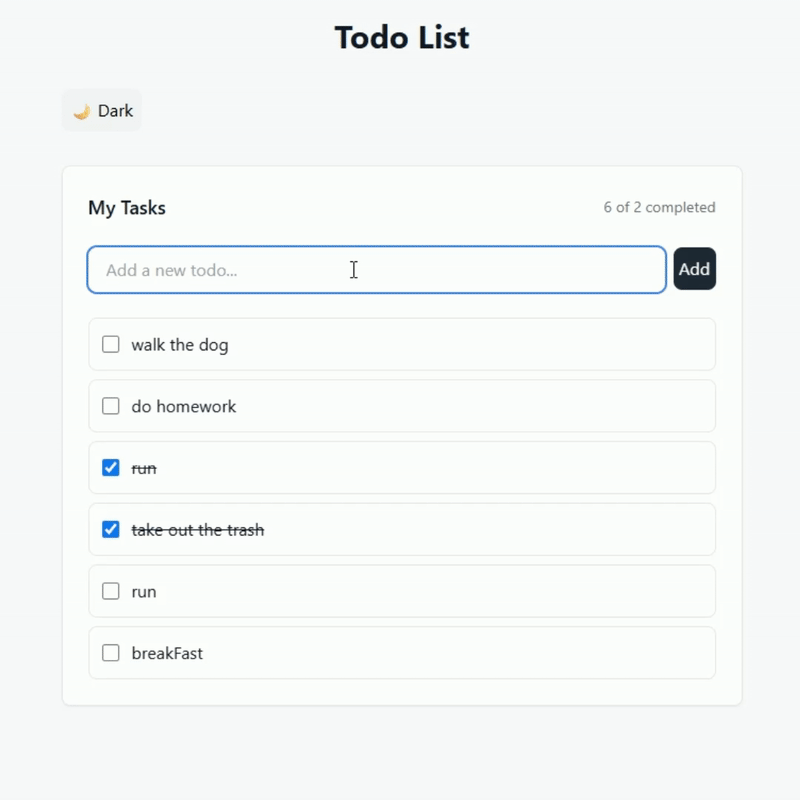

# Todo App

A Todo List made in React

## Demo

Website: https://lejoser40.github.io/React-Todo-List/

<div align="center" >
  
</div>

## Run Locally

Clone the project

```bash
  git clone https://github.com/Lejoser40/React-Todo-List.git
```

Go to the project directory

```bash
  cd React-Todo-List
```

Install dependencies

```bash
  npm install
```

Start the server

```bash
  npm start
```

Build project

```bash
  npm build
```
